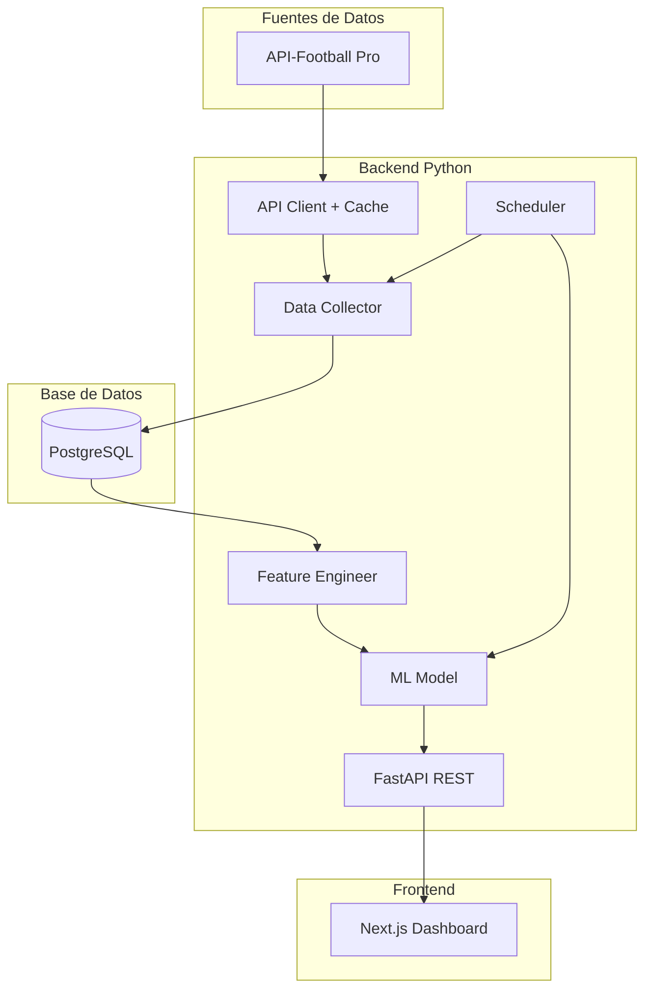
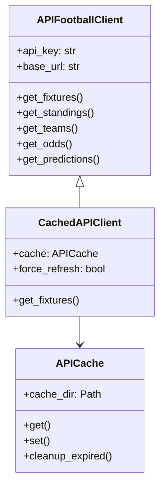
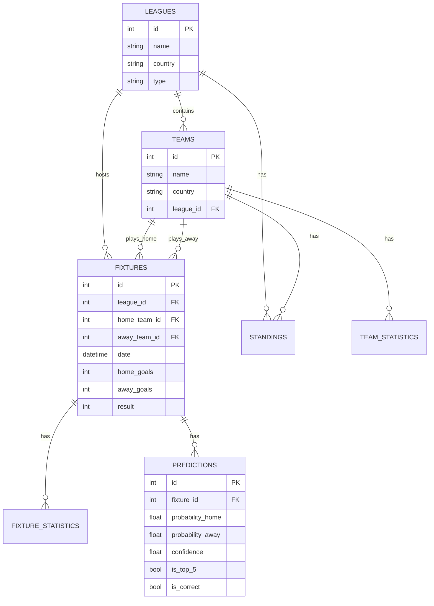
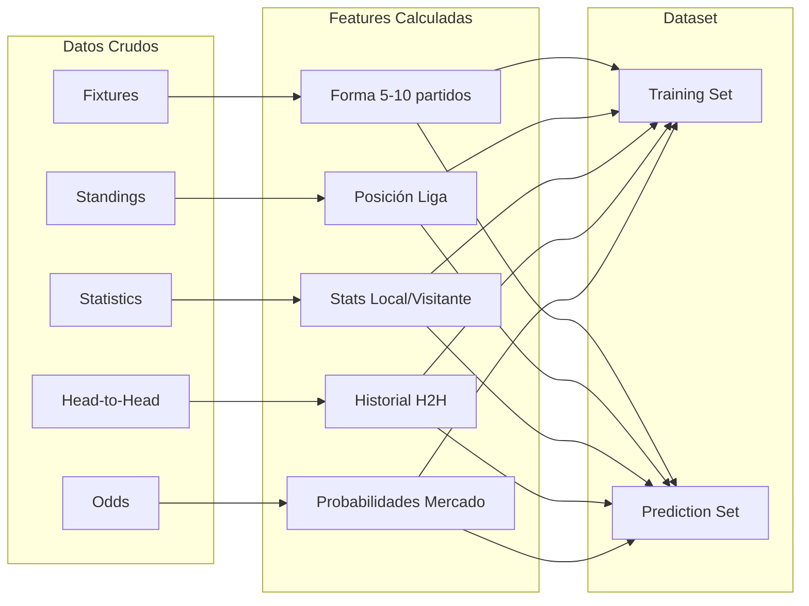
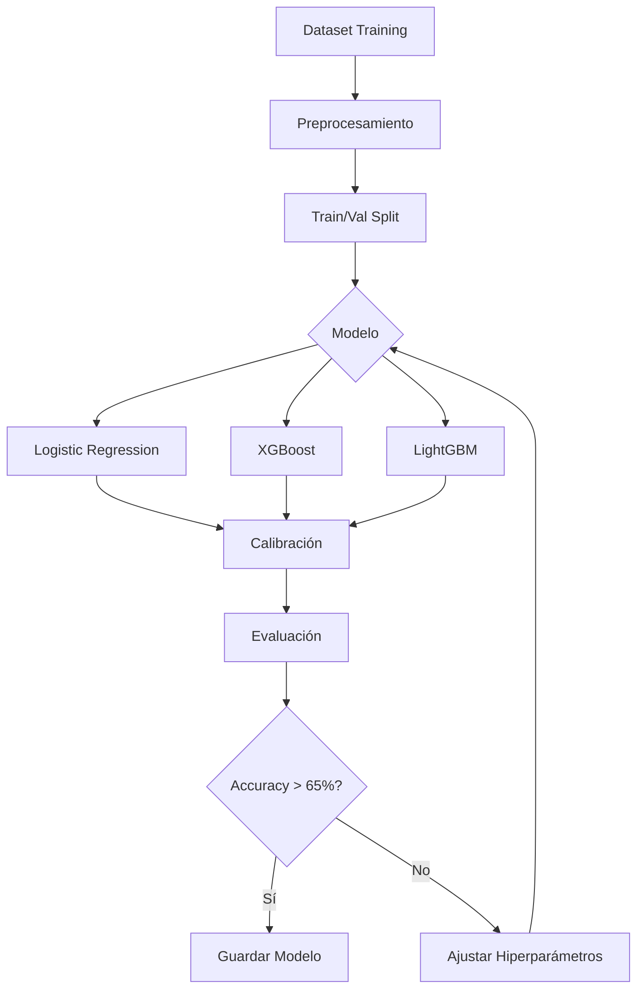
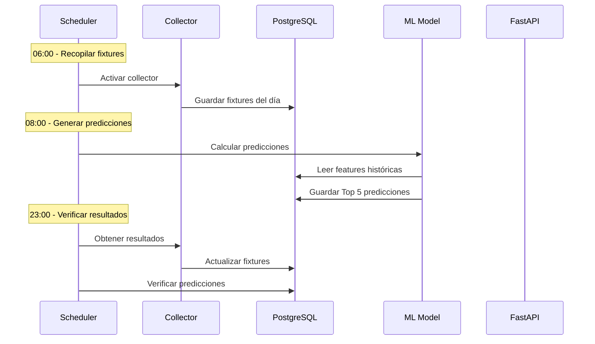

# 🏗️ Arquitectura del Sistema

## Visión General

Sistema de predicción de partidos de fútbol basado en Machine Learning que procesa datos de API-Football para generar predicciones diarias con alta fiabilidad.



---

## Componentes Principales

### 1. API Client (`src/api_client/`)



**Características:**
- Rate limiting automático (100 req/min)
- Caché basado en archivos con TTL configurable
- Logging estructurado con loguru
- Manejo de errores robusto

---

### 2. Base de Datos (`src/db/`)



**Repositorios disponibles:**
- `LeagueRepository` - CRUD ligas
- `TeamRepository` - CRUD equipos
- `FixtureRepository` - CRUD partidos
- `StandingRepository` - CRUD clasificaciones
- `PredictionRepository` - CRUD predicciones + stats

---

### 3. Feature Engineering (`src/data/`)



**Features principales (~69):**
- Forma histórica (rolling windows)
- Estadísticas de temporada
- Contexto de liga
- Head-to-head
- Cuotas del mercado

---

### 4. Modelo ML (`src/models/`)



**Flujo de predicción:**
1. Obtener partidos del día
2. Calcular features pre-partido
3. Predecir P(home) y P(away)
4. Filtrar por umbral 75%
5. Seleccionar Top 5 por confianza

---

### 5. API REST (`src/api/`)

**Endpoints principales:**

| Método | Endpoint | Descripción |
|--------|----------|-------------|
| GET | `/predictions/today` | Top 5 predicciones de hoy |
| GET | `/predictions/history` | Histórico de predicciones |
| GET | `/predictions/{id}` | Detalle de predicción |
| GET | `/stats/accuracy` | Estadísticas del modelo |
| GET | `/fixtures/upcoming` | Próximos partidos |

---

### 6. Frontend Dashboard

```mermaid
graph TB
    subgraph "Páginas"
        HOME[/ Dashboard Principal]
        HIST[/history Histórico]
        STATS[/stats Estadísticas]
    end
    
    subgraph "Componentes"
        TOP5[Top 5 Cards]
        CHART[Gráficos ROI]
        TABLE[Tabla Predicciones]
        FILTER[Filtros]
    end
    
    HOME --> TOP5
    HOME --> CHART
    HIST --> TABLE
    HIST --> FILTER
    STATS --> CHART
```

---

## Flujo de Datos Diario



---

## Estructura de Directorios

```
AnalizadorFutbol/
├── backend/
│   ├── src/
│   │   ├── api_client/     # Cliente API-Football + Cache
│   │   ├── data/           # Collectors + Feature Engineering
│   │   ├── models/         # ML Models + Training
│   │   ├── api/            # FastAPI REST
│   │   ├── db/             # SQLAlchemy Models + Repos
│   │   ├── scheduler/      # Jobs programados
│   │   └── utils/          # Config + Logging
│   ├── tests/
│   ├── alembic/            # Migraciones DB
│   └── requirements.txt
├── frontend/               # Next.js Dashboard
├── docs/                   # Documentación
└── notebooks/              # Exploración + Training
```

---

## Tecnologías

| Capa | Tecnología | Versión |
|------|------------|---------|
| Runtime | Python | 3.11 |
| API Framework | FastAPI | 0.104 |
| ORM | SQLAlchemy | 2.0 |
| ML | scikit-learn, XGBoost, LightGBM | Latest |
| Database | PostgreSQL | 15+ |
| Frontend | Next.js | 14 |
| Cache | File-based (JSON) | - |
| Migrations | Alembic | 1.13 |
