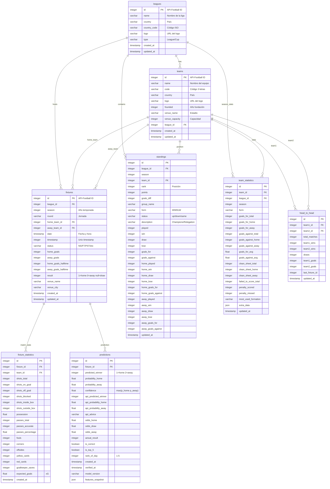

# 🗄️ Esquema de Base de Datos

## Diagrama ER Completo



---

## Tablas Detalladas

### `leagues`
Almacena información de ligas y competiciones.

| Columna | Tipo | Nullable | Descripción |
|---------|------|----------|-------------|
| id | INTEGER | NO | PK, ID de API-Football |
| name | VARCHAR(255) | NO | Nombre de la liga |
| country | VARCHAR(100) | SÍ | País |
| country_code | VARCHAR(3) | SÍ | Código ISO |
| logo | VARCHAR(500) | SÍ | URL del logo |
| type | VARCHAR(50) | SÍ | League/Cup |

---

### `teams`
Información de equipos.

| Columna | Tipo | Nullable | Descripción |
|---------|------|----------|-------------|
| id | INTEGER | NO | PK, ID de API-Football |
| name | VARCHAR(255) | NO | Nombre del equipo |
| code | VARCHAR(10) | SÍ | Código 3 letras |
| country | VARCHAR(100) | SÍ | País |
| founded | INTEGER | SÍ | Año de fundación |
| venue_name | VARCHAR(255) | SÍ | Nombre del estadio |
| venue_capacity | INTEGER | SÍ | Capacidad |
| league_id | INTEGER | SÍ | FK → leagues.id |

---

### `fixtures`
Partidos/fixtures con resultados.

| Columna | Tipo | Nullable | Descripción |
|---------|------|----------|-------------|
| id | INTEGER | NO | PK, ID de API-Football |
| league_id | INTEGER | NO | FK → leagues.id |
| season | INTEGER | NO | Año de temporada |
| round | VARCHAR(100) | SÍ | Jornada/Ronda |
| home_team_id | INTEGER | NO | FK → teams.id |
| away_team_id | INTEGER | NO | FK → teams.id |
| date | TIMESTAMP | NO | Fecha y hora |
| status | VARCHAR(50) | SÍ | NS, FT, PST, etc. |
| home_goals | INTEGER | SÍ | Goles local |
| away_goals | INTEGER | SÍ | Goles visitante |
| **result** | INTEGER | SÍ | **1=local, 0=visitante, NULL=empate** |

**Índices:**
- `ix_fixtures_date` - Por fecha
- `ix_fixtures_league_season` - Por liga y temporada

---

### `predictions`
Predicciones del modelo con verificación.

| Columna | Tipo | Nullable | Descripción |
|---------|------|----------|-------------|
| id | INTEGER | NO | PK, autoincrement |
| fixture_id | INTEGER | NO | FK → fixtures.id |
| predicted_winner | INTEGER | SÍ | 1=home, 2=away |
| probability_home | FLOAT | NO | P(local gana) |
| probability_away | FLOAT | NO | P(visitante gana) |
| confidence | FLOAT | NO | max(p_home, p_away) |
| is_top_5 | BOOLEAN | NO | ¿Está en Top 5 del día? |
| rank_of_day | INTEGER | SÍ | Posición 1-5 si es Top 5 |
| is_correct | BOOLEAN | SÍ | ¿Predicción acertada? |
| verified_at | TIMESTAMP | SÍ | Fecha de verificación |

**Índices:**
- `ix_predictions_created` - Por fecha creación
- `ix_predictions_top5` - Por is_top_5 + fecha

---

## Migraciones

### Crear migración inicial
```bash
cd backend
alembic revision --autogenerate -m "initial_schema"
```

### Aplicar migraciones
```bash
alembic upgrade head
```

### Revertir última migración
```bash
alembic downgrade -1
```

---

## Notas de Diseño

> [!IMPORTANT]
> **Campo `result` en `fixtures`:**  
> - `1` = Victoria local  
> - `0` = Victoria visitante  
> - `NULL` = Empate o partido no jugado  
> 
> Los empates se marcan como NULL para excluirlos del entrenamiento del modelo.

> [!TIP]
> **Uso de JSON:**  
> Los campos `extra_data` y `features_snapshot` permiten almacenar datos adicionales sin modificar el esquema.
