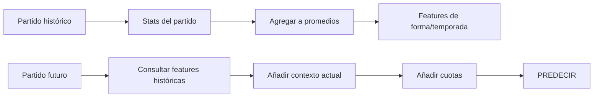

# 📊 Catálogo de Features - CORREGIDO

> [!IMPORTANT]  
> **Las features deben existir ANTES del partido.**  
> Solo usamos datos históricos y de contexto, NO estadísticas del partido a predecir.

---

## ⚠️ Distinción Crítica

| Tipo | ¿Cuándo existe? | ¿Se usa para predecir? |
|------|-----------------|------------------------|
| **Features PRE-PARTIDO** | Antes del partido | ✅ SÍ |
| **Datos POST-PARTIDO** | Después del partido | ❌ Solo para training |

```
PREDICCIÓN DE PARTIDO FUTURO:
├── ✅ Forma del equipo (partidos anteriores)
├── ✅ Posición en liga (antes del partido)
├── ✅ Head-to-head histórico
├── ✅ Cuotas de apuestas
├── ✅ Días de descanso
└── ❌ Tiros, posesión, corners del partido → NO EXISTEN AÚN
```

---

## ✅ FEATURES DISPONIBLES PRE-PARTIDO (~65)

### 1. Forma del Equipo (Historial Reciente)
*Calculadas sobre partidos YA JUGADOS*

| Feature | Ventana | Descripción |
|---------|---------|-------------|
| `puntos_ultimos_N` | 3, 5, 10 | Puntos obtenidos |
| `victorias_ultimos_N` | 3, 5, 10 | Conteo victorias |
| `goles_favor_avg_N` | 3, 5, 10 | Media goles anotados |
| `goles_contra_avg_N` | 3, 5, 10 | Media goles recibidos |
| `clean_sheets_N` | 5, 10 | Porterías a cero |
| `failed_to_score_N` | 5, 10 | Partidos sin marcar |
| `racha_actual` | - | WWDLW encoded |
| `racha_victorias` | - | Victorias consecutivas |
| `racha_sin_perder` | - | Partidos invicto |

**Variantes:**
- `*_home` → Solo partidos como local
- `*_away` → Solo partidos como visitante

---

### 2. Estadísticas de Temporada (Agregadas)
*Promedio de TODOS los partidos anteriores de la temporada*

| Feature | Descripción | Fuente |
|---------|-------------|--------|
| `xG_temporada_avg` | xG promedio por partido | `/teams/statistics` |
| `xGA_temporada_avg` | xGA promedio | `/teams/statistics` |
| `tiros_puerta_avg` | Tiros/partido promedio | `/teams/statistics` |
| `posesion_avg` | Posesión media | `/teams/statistics` |
| `corners_favor_avg` | Corners/partido | `/teams/statistics` |
| `tarjetas_amarillas_avg` | Amarillas/partido | `/teams/statistics` |
| `penaltis_favor_temp` | Penaltis a favor | `/teams/statistics` |
| `penaltis_contra_temp` | Penaltis en contra | `/teams/statistics` |

---

### 3. Contexto de Liga
*Estado ACTUAL antes del partido*

| Feature | Descripción | Fuente |
|---------|-------------|--------|
| `posicion_liga` | Posición actual | `/standings` |
| `puntos_totales` | Puntos acumulados | `/standings` |
| `diferencia_goles_temp` | GF - GC | `/standings` |
| `partidos_jugados` | PJ en temporada | `/standings` |
| `puntos_por_partido` | PPP | Cálculo |
| `distancia_lider` | Puntos al 1º | Cálculo |
| `distancia_descenso` | Puntos al último | Cálculo |
| `zona` | Champions/Europa/Descenso | `/standings` |

---

### 4. Head-to-Head (Histórico)
*Partidos anteriores entre estos equipos*

| Feature | Descripción |
|---------|-------------|
| `h2h_partidos_total` | Total enfrentamientos |
| `h2h_victorias_local` | Veces ganó el que hoy es local |
| `h2h_victorias_visitante` | Veces ganó el que hoy es visitante |
| `h2h_goles_local_avg` | Media goles |
| `h2h_goles_visitante_avg` | Media goles |
| `h2h_ultimo_resultado` | Último enfrentamiento |
| `h2h_ultimos_5` | Forma en últimos 5 H2H |

---

### 5. Factores Externos
*Conocidos antes del partido*

| Feature | Descripción | Fuente |
|---------|-------------|--------|
| `dias_descanso_local` | Días desde último partido | `/fixtures` |
| `dias_descanso_visitante` | Días desde último partido | `/fixtures` |
| `diferencia_descanso` | Ventaja de descanso | Cálculo |
| `es_entre_semana` | Martes-Jueves | Fecha |
| `jugo_copa_local` | Jugó Champions/Europa esta semana | Historial |
| `jugo_copa_visitante` | Jugó Champions/Europa esta semana | Historial |
| `es_derby` | Partido de rivalidad local | Manual/Config |

---

### 6. Lesiones y Bajas
*Estado actual de la plantilla*

| Feature | Descripción | Fuente |
|---------|-------------|--------|
| `lesiones_total_local` | Jugadores lesionados | `/injuries` |
| `lesiones_total_visitante` | Jugadores lesionados | `/injuries` |
| `goleador_disponible_local` | Top scorer disponible | `/injuries` + `/players` |
| `goleador_disponible_visit` | Top scorer disponible | `/injuries` + `/players` |

---

### 7. Mercado de Apuestas 🔴 CRÍTICO
*Las cuotas resumen toda la información del mercado*

| Feature | Descripción | Fuente |
|---------|-------------|--------|
| `odds_1` | Cuota victoria local | `/odds` |
| `odds_X` | Cuota empate | `/odds` |
| `odds_2` | Cuota victoria visitante | `/odds` |
| `prob_implicita_1` | 1/odds normalizada | Cálculo |
| `prob_implicita_2` | 1/odds normalizada | Cálculo |
| `overround` | Margen de la casa | Cálculo |
| `linea_over_under` | Línea O/U | `/odds` |

---

### 8. Predicciones de API-Football
*Como benchmark/feature adicional*

| Feature | Descripción | Fuente |
|---------|-------------|--------|
| `api_winner` | Predicción de la API | `/predictions` |
| `api_prob_home` | % local gana | `/predictions` |
| `api_prob_away` | % visitante gana | `/predictions` |
| `api_advice` | Consejo textual | `/predictions` |

---

### 9. Features Derivadas (Diferencias)
*Calculadas a partir de las anteriores*

| Feature | Cálculo |
|---------|---------|
| `diff_posicion` | pos_local - pos_visitante |
| `diff_puntos` | puntos_local - puntos_visitante |
| `diff_forma` | forma_local - forma_visitante |
| `diff_xG` | xG_local - xGA_visitante |
| `diff_descanso` | dias_local - dias_visitante |
| `diff_odds` | prob_impl_1 - prob_impl_2 |

---

## ❌ DATOS POST-PARTIDO (Solo para Training)

Estos datos **solo existen después** del partido.  
Se usan para **entrenar el modelo**, NO para predecir.

| Dato | Uso |
|------|-----|
| Tiros del partido | Training |
| Posesión del partido | Training |
| Corners del partido | Training |
| Tarjetas del partido | Training |
| xG del partido específico | Training |
| Resultado (1/X/2) | **TARGET** |

---

## 📋 Resumen Final

| Categoría | Features | Disponibilidad |
|-----------|----------|----------------|
| Forma histórica | 18 | ✅ Pre-partido |
| Stats temporada | 8 | ✅ Pre-partido |
| Contexto liga | 8 | ✅ Pre-partido |
| Head-to-Head | 7 | ✅ Pre-partido |
| Factores externos | 7 | ✅ Pre-partido |
| Lesiones | 4 | ✅ Pre-partido |
| Mercado apuestas | 7 | ✅ Pre-partido |
| API Predictions | 4 | ✅ Pre-partido |
| Diferencias | 6 | ✅ Pre-partido |
| **TOTAL** | **~69** | ✅ |

---

## 🎯 Flujo de Datos


