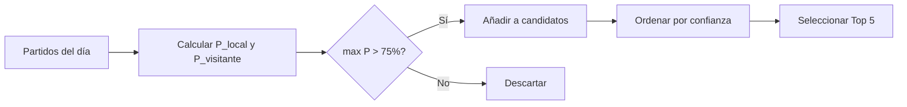

# 🎯 Plan Definitivo: IA Predicción de Partidos de Fútbol

## Resumen de Configuración

| Categoría | Decisión |
|-----------|----------|
| **Ligas** | Todas las ligas del mundo |
| **Predicción** | Binaria: 1 (Local) o 2 (Visitante) - **Sin empates** |
| **Umbral confianza** | 75% mínimo para recomendar |
| **Predicciones diarias** | Siempre 5 (fijo) |
| **Plan API** | Pro (7,500 req/día) |
| **Base de datos** | PostgreSQL |
| **Frontend** | Dashboard completo, dark/light auto |

---

## 🧠 Enfoque del Modelo

> [!IMPORTANT]
> **Modelo binario puro**: Los empates se excluyen completamente del dataset.
> - Training: Solo partidos con resultado 1 o 2
> - Predicción: P(Local gana) vs P(Visitante gana)
> - Partidos históricos con empate = **NULOS** (no se usan)

```
Dataset de entrenamiento:
├── ✅ Victoria Local (1) → Label: 1
├── ❌ Empate (X) → EXCLUIDO
└── ✅ Victoria Visitante (2) → Label: 0
```

### Flujo de Predicción Diaria


---

## 📊 Features del Modelo

> [!WARNING]
> Solo usamos features que existen **ANTES** del partido.
> Las estadísticas del partido (tiros, posesión) NO están disponibles para predicción.

Ver documento completo: [features_catalog.md](./features_catalog.md)

### Resumen de Features PRE-PARTIDO (~69)

| Categoría | Cantidad | Disponibilidad |
|-----------|----------|----------------|
| Forma histórica (rolling) | 18 | ✅ Pre-partido |
| Stats agregadas temporada | 8 | ✅ Pre-partido |
| Contexto de liga | 8 | ✅ Pre-partido |
| Head-to-Head histórico | 7 | ✅ Pre-partido |
| Factores externos | 7 | ✅ Pre-partido |
| Lesiones/Bajas | 4 | ✅ Pre-partido |
| Mercado apuestas | 7 | ✅ Pre-partido |
| API Predictions | 4 | ✅ Pre-partido |
| Diferencias calculadas | 6 | ✅ Pre-partido |

### Features Críticas
1. **Forma reciente** (puntos/goles últimos 5)
2. **Posición en liga** actual
3. **Rendimiento local/visitante** histórico
4. **Head-to-head** reciente
5. **Cuotas del mercado** (resumen de toda la info)

| Capa | Tecnología |
|------|------------|
| **Backend** | Python 3.11, FastAPI |
| **ML** | scikit-learn, XGBoost, LightGBM |
| **Base de datos** | PostgreSQL |
| **ORM** | SQLAlchemy |
| **Frontend** | Next.js 14, React, Tailwind |
| **Tema** | Auto (dark/light según sistema) |

---

## 📂 Estrategia Git

### Modelo: Git Flow
```
main ─────────────────────────────────────────────►
  │
  └── develop ────────────────────────────────────►
        │
        ├── feature/api-client ──► PR → develop
        ├── feature/ml-model ────► PR → develop
        ├── feature/dashboard ───► PR → develop
        │
        └── release/v1.0 ────────► PR → main
```

### Ramas
| Rama | Propósito |
|------|-----------|
| `main` | Producción estable |
| `develop` | Integración de features |
| `feature/*` | Nuevas funcionalidades |
| `release/*` | Preparación de releases |
| `hotfix/*` | Correcciones urgentes |

### Conventional Commits
```
feat: nueva funcionalidad
fix: corrección de bug
docs: documentación
refactor: refactorización sin cambio funcional
test: añadir/modificar tests
chore: tareas de mantenimiento
style: formato, espacios (no afecta código)
perf: mejoras de rendimiento
```

### CI/CD (GitHub Actions)
- ✅ Tests automáticos en cada PR
- ❌ Deploy automático (no necesario, local)

---

## 📊 Lógica de Negocio

| Aspecto | Configuración |
|---------|---------------|
| **Bankroll** | No simulado (solo ROI %) |
| **Stake** | Flat (cantidad fija) |
| **Cuotas mínimas** | Sin límite |
| **Verificación** | Automática al día siguiente |

### Métricas a Trackear
- Accuracy general
- Accuracy en Top 5 diarias
- ROI porcentual acumulado
- Comparación vs API-Football predictions
- Comparación vs probabilidades de cuotas

---

## 🖥️ Dashboard - Funcionalidades

| Funcionalidad | Incluida |
|---------------|----------|
| Top 5 predicciones del día | ✅ |
| Gráfico evolución bankroll/ROI | ✅ |
| Gráfico calibración modelo | ✅ |
| Filtros por liga/país | ✅ |
| Exportar a CSV | ✅ |
| Notificaciones | ✅ |
| Histórico de predicciones | ✅ |
| Estadísticas por liga | ✅ |
| Dark/Light mode | ✅ Auto |
| Login | ❌ (uso personal) |

---

## 📚 Documentación

| Elemento | Incluido |
|----------|----------|
| README.md | ✅ |
| Docstrings en código | ✅ |
| Guía de arquitectura | ✅ |
| ADRs (Architecture Decision Records) | ✅ |
| Diagramas (Mermaid) | ✅ |
| Wiki/Docs detallada | ✅ |
| **Idioma** | Español |

---

## 📁 Estructura del Proyecto

```
AnalizadorFutbol/
├── .github/
│   ├── workflows/
│   │   └── tests.yml           # CI: tests automáticos
│   └── PULL_REQUEST_TEMPLATE.md
│
├── backend/
│   ├── src/
│   │   ├── api_client/         # Cliente API-Football
│   │   ├── data/               # Procesamiento datos
│   │   ├── models/             # ML models
│   │   ├── api/                # FastAPI REST
│   │   ├── db/                 # PostgreSQL models
│   │   └── scheduler/          # Jobs diarios
│   ├── tests/
│   ├── requirements.txt
│   └── config.yaml
│
├── frontend/
│   ├── src/
│   │   ├── app/                # Next.js pages
│   │   ├── components/
│   │   └── styles/
│   └── package.json
│
├── docs/
│   ├── architecture.md
│   ├── adr/                    # Decision Records
│   │   ├── 001-binary-model.md
│   │   └── ...
│   └── diagrams/
│
├── notebooks/                  # Exploración y training
│
├── .env.example
├── .gitignore
├── docker-compose.yml          # Solo para PostgreSQL
└── README.md
```

---

## 📅 Fases de Desarrollo

### Fase 1: Setup Inicial
- [ ] Crear estructura de carpetas
- [ ] Configurar Git Flow (main + develop)
- [ ] Crear .gitignore, .env.example
- [ ] Configurar GitHub Actions para tests
- [ ] Setup PostgreSQL local
- [ ] requirements.txt inicial

### Fase 2: Cliente API-Football
- [ ] Implementar cliente HTTP
- [ ] Endpoints: fixtures, statistics, h2h
- [ ] Sistema de caché
- [ ] Rate limiting
- [ ] Tests unitarios

### Fase 3: Base de Datos
- [ ] Modelos SQLAlchemy
- [ ] Migrations (Alembic)
- [ ] Repositorios de acceso a datos

### Fase 4: Recopilación de Datos
- [ ] Collector de históricos
- [ ] Almacenar en PostgreSQL
- [ ] Verificar calidad de datos

### Fase 5: Feature Engineering
- [ ] Pipeline de features
- [ ] Features rolling (forma, goles, etc.)
- [ ] Dataset para training

### Fase 6: Modelado ML
- [ ] Baseline (Logistic Regression)
- [ ] XGBoost / LightGBM
- [ ] Calibración de probabilidades
- [ ] Evaluación y backtesting

### Fase 7: API Backend
- [ ] FastAPI setup
- [ ] Endpoints REST
- [ ] Job scheduler diario

### Fase 8: Frontend Dashboard
- [ ] Next.js setup
- [ ] Página principal (Top 5)
- [ ] Histórico
- [ ] Gráficos y analytics
- [ ] Filtros y exportación

### Fase 9: Integración y Testing
- [ ] Tests end-to-end
- [ ] Pruebas con datos reales
- [ ] Refinamiento

---

## ⏭️ Siguiente Paso

Cuando des el OK, comenzaré con **Fase 1: Setup Inicial**:
1. Crear estructura de carpetas en el repositorio
2. Configurar Git (rama develop)
3. Crear archivos base (.gitignore, README, etc.)
